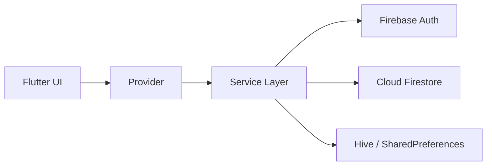
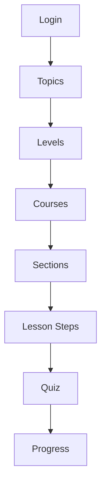

# Алдын ала қорғауға арналған презентация

## Тақырып
**Қазақ тіліне бейімделген ым-ишара тілін үйренуге арналған мобильді қосымша жасау**

---

## 1-слайд. Титулдық бет

### Слайдқа енгізілетін мәліметтер
- Дипломдық жұмыс тақырыбы: **Қазақ тіліне бейімделген ым-ишара тілін үйренуге арналған мобильді қосымша жасау**
- Жобаның атауы: **Alaqan**
- Орындаған студенттің аты-жөні
- Университет, мамандық
- Ғылыми жетекші
- Қала, жыл
- Қосымшаның логотипі

### Ауызша айтылатын қысқа мәтін
«Менің дипломдық жұмысым қазақ тіліне бейімделген ым-ишара тілін үйренуге арналған мобильді қосымша жасауға бағытталған. Жобаның негізгі мақсаты — оқыту материалдарын бір жүйеге келтіріп, пайдаланушыға ыңғайлы, көптілді және кеңейтуге болатын цифрлық орта ұсыну».

---

## 2-слайд. Тақырыптың өзектілігі

### Слайдқа енгізілетін негізгі ойлар
**Өзектілігі**
- Қазақ тіліне бейімделген ым-ишара тілін оқытуға арналған цифрлық шешімдер саны аз
- Оқу материалдары бір жүйеге келтірілмеген
- Пайдаланушыға оқу барысын бақылау және қайталау ыңғайсыз
- Контентті орталықтандырылған түрде басқару мүмкіндігі жеткіліксіз

**Практикалық маңызы**
- Инклюзивті цифрлық білім беру құралдарына сұраныс артып келеді
- Мобильді формат оқытуды кез келген жерде жалғастыруға мүмкіндік береді
- Көптілді интерфейс әртүрлі пайдаланушыларға қолжетімділікті арттырады

### Ауызша айтылатын қысқа мәтін
«Бұл тақырыптың өзектілігі қазіргі таңда қазақ тіліне бейімделген ым-ишара тілін үйренуге арналған ыңғайлы әрі құрылымдалған цифрлық платформалардың аз болуымен түсіндіріледі. Сондықтан мен оқыту, тестілеу, прогресті бақылау және контентті басқару мүмкіндіктерін бір жүйеге біріктіруді мақсат еттім».

---

## 3-слайд. Жобаның мақсаты, міндеттері, болжамы

### Мақсаты
- Қазақ тіліне бейімделген ым-ишара тілін үйренуге арналған кроссплатформалы мобильді қосымша әзірлеу

### Міндеттері
1. Қосымшаның архитектурасын жобалау
2. Пайдаланушыны тіркеу және авторизациялау жүйесін жүзеге асыру
3. Тақырыптар, деңгейлер, курстар, бөлімдер, сабақтар және тесттер иерархиясын құру
4. `kk`, `ru`, `en` тілдеріне арналған көптілді интерфейс енгізу
5. Оқу прогресін және тест нәтижелерін сақтау механизмін жасау
6. Пайдаланушы профилі мен прогресс экранын әзірлеу
7. Контентті басқаруға арналған web-admin бөлімін жасау
8. Жекелеген курсқа шектеулі қолжетімділік беру сценарийін енгізу

### Болжам
- Егер оқу материалдары, тестілеу, прогресс және әкімшілік басқару бір мобильді жүйеге біріктірілсе, онда ым-ишара тілін үйрену үдерісі қолжетімді, тиімді және басқаруға ыңғайлы болады

### Ауызша айтылатын қысқа мәтін
«Жобаның мақсаты тек әдемі интерфейс жасау емес, толыққанды жұмыс істейтін білім беру жүйесін құру болды. Сол себепті мен қосымшада тек экрандарды емес, деректер құрылымын, прогресті сақтау логикасын және әкімшілік басқару бөлігін де қарастырдым».

---

## 4-слайд. Қолданылған технологиялар

### Слайдқа енгізілетін кесте
| Технология | Қолданылу мақсаты |
|---|---|
| `Flutter` | Бір кодтық базамен mobile және web платформаларын қолдау |
| `Provider` | Қолданба күйін басқару |
| `Firebase Auth` | Авторизация және аутентификация |
| `Cloud Firestore` | Курстар, сабақтар, тесттер, прогресс деректерін сақтау |
| `Hive` | Жергілікті сақтау және офлайн элементтер |
| `SharedPreferences` | Тіл, баптаулар, пайдаланушы параметрлері |
| `Google Sign-In` | Ыңғайлы кіру және әкімші панеліне қолжетімділік |

### Неліктен осы технологиялар таңдалды
- Бір жоба аясында бірнеше платформаны қолдауға мүмкіндік береді
- Backend бөлігін жылдам іске асыруға ыңғайлы
- Иерархиялық оқу құрылымын сақтауға қолайлы
- Жобаны әрі қарай кеңейтуге мүмкіндік береді

### Ауызша айтылатын қысқа мәтін
«Технологияларды таңдаудағы негізгі өлшем — практикалық тиімділік болды. Flutter кроссплатформалықты қамтамасыз етсе, Firebase авторизация мен деректерді сақтауды жеңілдетті. Бұл шешімдер жобаны тез әзірлеуге және болашақта кеңейтуге мүмкіндік береді».

---

## 5-слайд. Жобаның архитектурасы

### Слайдқа енгізілетін мазмұн
**Құрылымдық қабаттар**
- `presentation/` — экрандар, виджеттер, provider қабаты
- `services/` — авторизация, Firestore, локалды сақтау сервистері
- `data/models/` — деректер модельдері
- `core/` — тақырып, локализация, тұрақтылар, конфигурациялар

**Firestore деректер құрылымы**
```text
topics/{topicId}
levels/{levelId}
courses/{courseId}
  sections/{sectionId}
    lessons/{lessonId}
      tests/{testId}
users/{userId}
  progress/{courseId}
```

### Mermaid-схема


### Негізгі ой
- Интерфейс, логика және деректер сақтау бөлігі өзара бөлінген
- Қосымша жаңа контент қосуға дайын күйде жасалған
- Әкімші бөлігі осы архитектурамен бір жоба ішінде жұмыс істейді

### Ауызша айтылатын қысқа мәтін
«Архитектура бірнеше қабатқа бөлінген. Бұл тәсіл кодты түсінікті етеді, қызметтерді бөлек басқаруға мүмкіндік береді және жобаны кейін масштабтауды жеңілдетеді».

---

## 6-слайд. Жүзеге асырылған функционал

### Слайдқа енгізілетін мәліметтер
**Пайдаланушы бөлігі**
- Тіркелу және жүйеге кіру
- Оқу тақырыптарын таңдау
- Деңгей бойынша бөлу
- Курстар каталогы, сүзгілеу және іздеу
- Сабақты қадам бойынша өту
- Тест тапсыру
- Профиль және прогресс бөлімі

**Қосымша мүмкіндіктер**
- Үш тілдегі интерфейс: `қазақша`, `орысша`, `ағылшынша`
- Прогресті және тест нәтижелерін сақтау
- `Plans` бөлімі арқылы демонстрациялық жазылым
- `Professions` курсын құлыппен шектеу

### Ауызша айтылатын қысқа мәтін
«Қазіргі нұсқада пайдаланушы толық оқу жолынан өте алады: жүйеге кіреді, тақырып таңдайды, сабақ оқиды, тест тапсырады және өзінің оқу прогресін көреді. Бұдан бөлек, жүйеде белгілі бір курсқа шектеулі қолжетімділік сценарийі де енгізілген».

---

## 7-слайд. Пайдаланушының жұмыс сценарийі

### Слайдқа енгізілетін тізбек
1. Жүйеге кіру
2. Тақырып таңдау
3. Деңгей таңдау
4. Курсқа өту
5. Бөлімдер мен сабақтарды оқу
6. Тест тапсыру
7. Нәтижені сақтау
8. Профильдегі прогресті қарау

### Mermaid-схема


### Ауызша айтылатын қысқа мәтін
«Пайдаланушы сценарийі бірізді логикамен құрылған. Яғни, қолданушы оқу тақырыбын таңдап, сабақтарды өтіп, тест нәтижелерін автоматты түрде сақтай алады. Бұл оқыту процесін жүйелі етеді».

---

## 8-слайд. Нәтижелер: пайдаланушы бөлігі

### Слайдқа енгізілетін скриншоттар
- Жүйеге кіру экраны
- Басты бет
- Курстар каталогы
- Сабақ немесе тест экраны
- Прогресс бөлімі
- `Plans` бөлімі

### Негізгі нәтижелер
- Қосымшаның пайдаланушы сценарийі жұмыс істейді
- Контент интерфейс тіліне сай бейімделіп көрсетіледі
- Прогресс Firestore базасында сақталады
- `Plans` бөлімінде шектеулі қолжетімділік механизмі көрсетілген
- `Professions` курсы жазылым арқылы ашылатын етіп құлыпталған

### Ауызша айтылатын қысқа мәтін
«Бұл слайдта мен пайдаланушы бөлігі толық жұмыс істейтінін көрсетемін. Әсіресе, прогресті сақтау, каталогпен жұмыс және `Plans` бөлімі арқылы белгілі бір курсқа қолжетімділікті басқару жобаның практикалық деңгейін көрсетеді».

---

## 9-слайд. Нәтижелер: әкімшілік бөлік

### Слайдқа енгізілетін скриншоттар
- `Admin Gate`
- `Admin Dashboard`
- Курс немесе бөлім басқару экраны
- Сабақтарды басқару экраны

### Слайдқа енгізілетін ойлар
- Web-admin режимі сол Flutter жобасының ішінде іске асырылған
- Әкімшіге кіру тек рұқсат етілген Google аккаунт арқылы жүзеге асады
- Тақырыптар, курстар, бөлімдер, сабақтар бойынша басқару мүмкіндігі бар
- Контентті кодқа өзгеріс енгізбей толықтыруға болады

### Ауызша айтылатын қысқа мәтін
«Жобаның маңызды артықшылығы — әкімшілік бөліктің де дайын болуы. Бұл жүйені жай демонстрациялық қосымша емес, әрі қарай қолдануға және дамытуға болатын білім беру платформасы ретінде қарастыруға мүмкіндік береді».

---

## 10-слайд. Қорытынды және болашақ даму

### Слайдқа енгізілетін мазмұн
**Қорытынды**
- Қазақ тіліне бейімделген ым-ишара тілін үйренуге арналған мобильді қосымша әзірленді
- Пайдаланушы және әкімші бөліктері жүзеге асырылды
- Көптілділік, прогресс, тестілеу және деректерді орталықтандырылған сақтау енгізілді
- Жоба архитектурасы кеңейтуге дайын

**Практикалық маңызы**
- Қолжетімді цифрлық оқыту ортасын қалыптастырады
- Контентті орталықтандырылған түрде жаңартуға мүмкіндік береді
- Инклюзивті білім беру бастамаларына бейімделе алады

**Болашақ даму бағыттары**
- Нақты төлем жүйесін қосу
- Тест редакторын әкімші панеліне енгізу
- Пайдаланушы аналитикасын қосу
- Push-хабарламалар енгізу
- Offline-first режимін тереңдету
- Ым-ишараны тану модулін ML арқылы дамыту

### Қорытынды сөз
«Осылайша, әзірленген жоба қазақ тіліне бейімделген ым-ишара тілін үйренуге арналған мобильді қосымша ретінде практикалық мәнге ие. Жүйеде пайдаланушыға арналған оқу сценарийі, прогресті сақтау және контентті басқаруға арналған әкімшілік бөлік толық қарастырылған».

---

## 5–7 минуттық ауызша баяндама жоспары

1. Тақырып пен өзектілік — 40 секунд
2. Мақсат, міндеттер, болжам — 40 секунд
3. Қолданылған технологиялар — 50 секунд
4. Архитектура және деректер құрылымы — 60 секунд
5. Пайдаланушы функционалы — 60–70 секунд
6. Нәтижелер мен экрандарды көрсету — 90 секунд
7. Қорытынды және болашақ даму — 30–40 секунд

---

## Қорғауда ерекше атап өтуге болатын артықшылықтар

- Жоба **кроссплатформалы**
- Интерфейс **3 тілде** жұмыс істейді
- Жүйеде **пайдаланушы және әкімші** бөліктері бар
- Контент **Cloud Firestore** арқылы басқарылады
- Сабақтар, тесттер және прогресс логикасы толық енгізілген
- `Plans` арқылы **шектеулі курсқа қолжетімділік** көрсету мүмкіндігі бар
- Жоба әрі қарай кеңейтуге дайын архитектурамен жасалған
